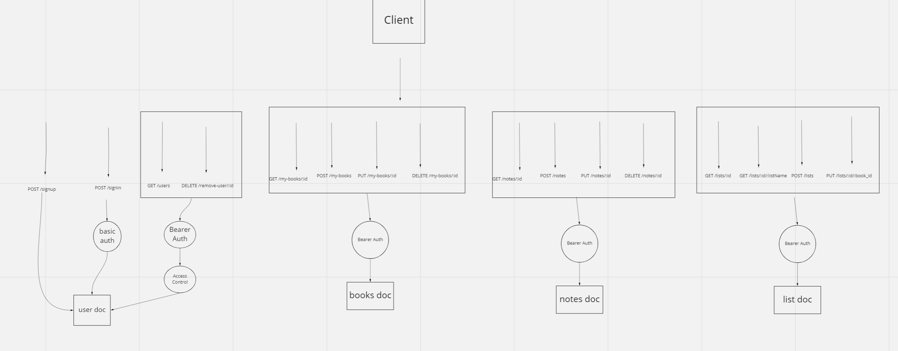

# My Virtual Bookshelf API Server

**Author**: Brooke Heck

**Version**: 1.0.0

## Overview
This is a an api used to store users, and the books and notes that they save to their account. MongoDB is used to store all the data and Mongoose is used to connect and query the database. The user can also create customized lists and add saved books to their lists. After the user creates an account, basic auth is used for authentication. With successful sign in, the user receives a token that must send to the server with all other requests. Access control is used for managing users. To get all the users and delete a user, the user must have an admin role.

## Deployed Server
[https://virtual-books-bh.herokuapp.com](https://virtual-books-bh.herokuapp.com/)

## Architecture and Routes

## Change Log
10-02-2022 08:26pm - version one fully functional, all routes and middleware working